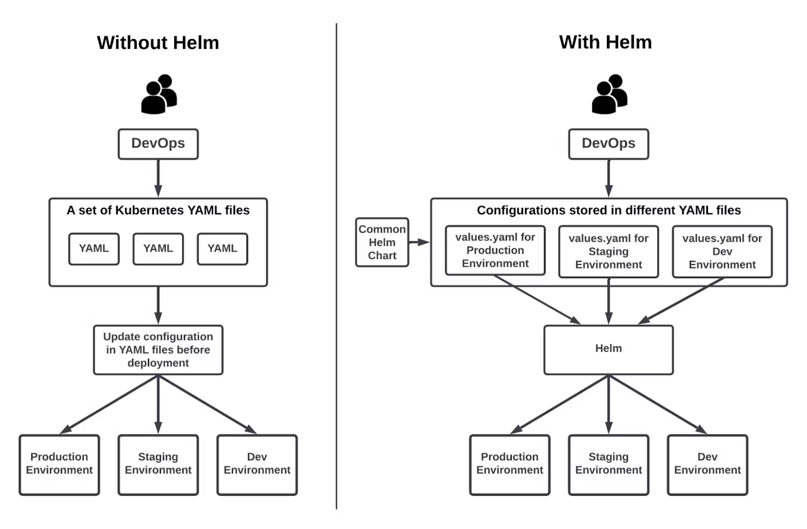

# cloud-native-workshop

While we often rely heavily on infrastructure teams to manage deployments, cloud-native development empowers developers to take control of the deployment process.

In this workshop, you will learn:

* What Cloud-Native is, why it's essential, and how you can explore it on your own.
* How to deploy applications securely using secrets management.

By the end of this session, you'll gain hands-on experience and insights into modern deployment strategies that can help streamline your workflow and improve efficiency.

### Setup

```shell
brew install colima docker kubernetes-cli minikube helm kubeseal
colima start
minikube start
minikube dashboard
```

## The Evolution of Application Deployment

### The Early Days: Manual Setup and Configuration

In the early days of the internet, deploying applications was a hands-on process. Developers and system administrators would log into physical machines, install the necessary libraries, and configure environments manually.

While this approach initially worked, several challenges emerged over time:

* Complex Library Management: Applications often shared libraries, making version conflicts and compatibility issues difficult to manage.
* Inconsistent Environments: Differences between local development setups and production environments led to unpredictable behavior.
* High Downtime and Effort: Deployments could take hours or even days, often requiring teams to work late into the night.

### Virtual Machines: A Step Towards Isolation

To address these challenges, Virtual Machines (VMs) were introduced. A VM simulates a full machine, allowing developers to create a dedicated environment for each application release.


Benefits of VMs:

* Applications and their dependencies were isolated from each other.
* Developers could replicate production environments locally.

Drawbacks of VMs:

Performance Issues: Since VMs simulate hardware and run separate operating systems, they are slower than native execution.

* Large Storage Requirements: VM images consume significant disk space.
* Slow Deployment Process: Booting up and configuring VMs added delays to the deployment cycle.

### The Rise of Containers: Efficiency and Speed

Then came Docker. Unlike VMs, Docker introduced containers, which provide lightweight and efficient application isolation. Containers bundle applications with their dependencies while sharing the same operating system kernel.


Advantages of Containers:

* Fast Deployment: Applications can be started instantly, just like running them on a native machine.
* Efficient Resource Usage: Containers are much lighter than VMs since they don’t need a full OS for each instance.
* Improved Isolation: Each container operates independently, reducing conflicts between applications.

However, new challenges arose:

Businesses demanded faster and more scalable solutions.

The rise of microservices architecture meant managing multiple containers became complex.

While Docker was great at packaging applications, it lacked built-in support for high availability and scalability.

### Kubernetes: The Era of Cloud-Native Applications

To overcome these challenges, Kubernetes was introduced as a container orchestration platform. It became the foundation of Cloud-Native Development, which leverages cloud infrastructure to build, deploy, and scale applications efficiently.

Why Kubernetes?


* Automated Scaling and Deployment: Kubernetes efficiently manages containerized applications, ensuring high availability and resilience.
* Self-Healing Capabilities: If a container crashes, Kubernetes automatically restarts it.
* Infrastructure as Code (IaC) Integration: Kubernetes allows infrastructure to be defined using code, enabling automation and version control.

### Infrastructure as Code (IaC): Automating Deployment

While Kubernetes itself isn't strictly infrastructure as code (IaC), it's designed to be managed and deployed using IaC principles, allowing you to define and manage your container orchestration layer and application definitions with code. 
Infrastructure as Code (IaC) is the practice of defining and managing infrastructure using machine-readable configuration files, ensuring consistency and automation in deployments.

Why Kubernetes is Ideal for IaC:

* Declarative Configuration: Kubernetes uses YAML/JSON manifests, making it easy to version, review, and deploy configurations.
* Automation: Kubernetes automates tasks like scaling, networking, and service discovery.
* Scalability & Repeatability: IaC ensures that Kubernetes clusters and applications can be deployed consistently across environments.

### Conclusion

From manually configuring machines to leveraging Kubernetes for cloud-native applications, deployment strategies have evolved to meet the growing demands of businesses. By embracing containers, orchestration, and IaC, modern development teams can achieve scalability, reliability, and automation in their application deployment processes.

## How to release an application via Kubernetes

### Create an Stateless Application

```shell
kubectl apply -f application/secret.yaml
kubectl apply -f application/deployment.yaml
kubectl apply -f application/service.yaml
minikube tunnel
```

As we discussed in the Infrastructure as Code (IaC) approach for Kubernetes, Kubernetes uses Declarative Configuration, meaning it continuously ensures that the system state matches the defined configuration.

However, for most applications:

* Multiple Kubernetes objects need to be created to complete a release.
* Managing a release is different from traditional version control.

### Helm

A Release is an instance of a chart running in a Kubernetes cluster. One chart can often be installed many times into the same cluster. And each time it is installed, a new release is created. 



```shell
helm create helm101
helm package helm101
helm install helm101 helm101-0.1.0.tgz
```

### Sealed Secret

#### Kubernetes Secrets

```
echo -n 'my-app' | base64
echo -n '39528$vdg7Jb' | base64

kubectl apply -f application/secret.yaml
```

Kubernetes Secrets use base64 encoding, which is not an encryption method but simply plain text encoding. How can we apply IaC to manage secrets securely?

#### Setup SealedSecret Controller

```
helm repo add sealed-secrets https://bitnami-labs.github.io/sealed-secrets
kubectl create namespace security
helm install sealed-secrets -n security sealed-secrets/sealed-secrets
```

#### Generate an encrypted secret for version control

```shell
kubectl create secret generic secret-name --dry-run=client --from-literal=foo=bar -o yaml | \
kubeseal \
  --controller-name=sealed-secrets \
  --controller-namespace=security \
  --format yaml > application/sealed_secret.yaml

kubectl apply -f application/sealed_secret.yaml
```